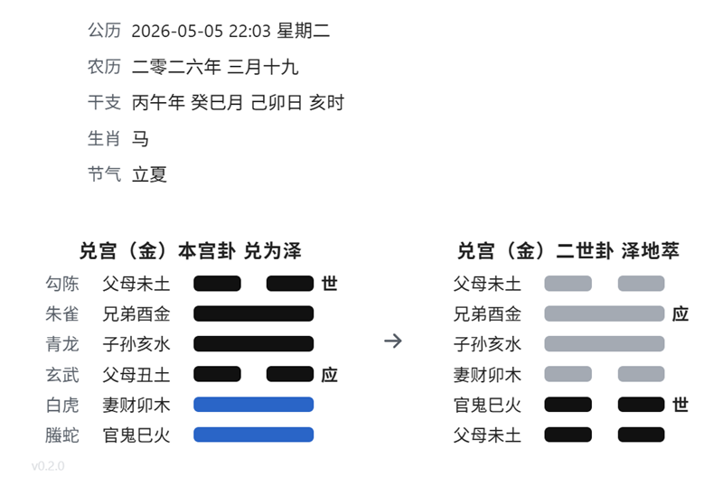

# Obsidian Liuyao Plugin

This plugin renders six-line divination diagrams in Obsidian from a fenced `liuyao` code block.

## 0.2.x Released
You can now choose the color of the dynamic Yaos.

## Supported Syntax

<pre>
```liuyao
  123123
```
</pre>

The `liuyao` block can also include a date on the first non-empty line and the hexagram input on the second line:

<pre>
```liuyao
  2026-05-05 22:03
  332112
```
</pre>

It will be rendered like


## Rules

- The input must contain exactly 6 digits.
- Each digit must be one of `0`, `1`, `2`, or `3`.
  - `0`: old yin, 老阴
  - `1`: young yang, 少阳
  - `2`: young yin, 少阴
  - `3`: old yang, 老阳
- The first digit is the bottom line, and the sixth digit is the top line.
- The plugin looks up the matching hexagram metadata from `src/core/common.ts`.
- A `liuyao` block may optionally use the first non-empty line as a date and the second non-empty line as the hexagram input.
- The hexagram input also supports 6 trigram names, such as `坤坎离离震兑`.


The rendered card shows:

- The six gods on the far left when a valid date is provided
- The family and hexagram name at the top, such as `乾宫 乾为天`
- The line relation text on the left of each line
- The `世` or `应` marker on the right when present

## Development

The source entry is `src/main.ts`, and build artifacts are written to `dist/`.

1. Install dependencies: `pnpm install`
2. Build the plugin: `pnpm build`

The build produces:

- `dist/main.js`
- `dist/manifest.json`
- `dist/styles.css`

Copy those three files into your vault at `.obsidian/plugins/liuyao/`.
